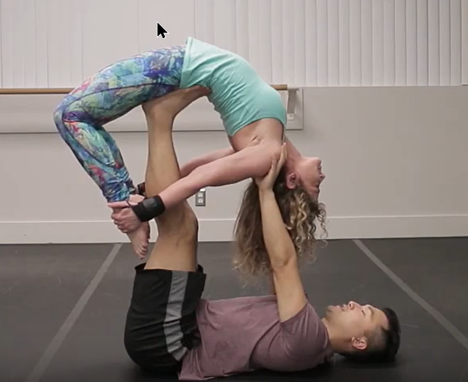

### Base

- arm on knees and arm on upper back seem comfortable

### Flyer

- Try not to be too tense or straight, it's more confortable if you bring your bum down a bit

## Drills

No drills

<!-- [super dave video](https://www.youtube.com/watch?v=qa5iG6k3W0s) -->

:::section{.variantes}

## Variantes

No varientes

<!-- - 
  _Bow pose_ -->

:::
